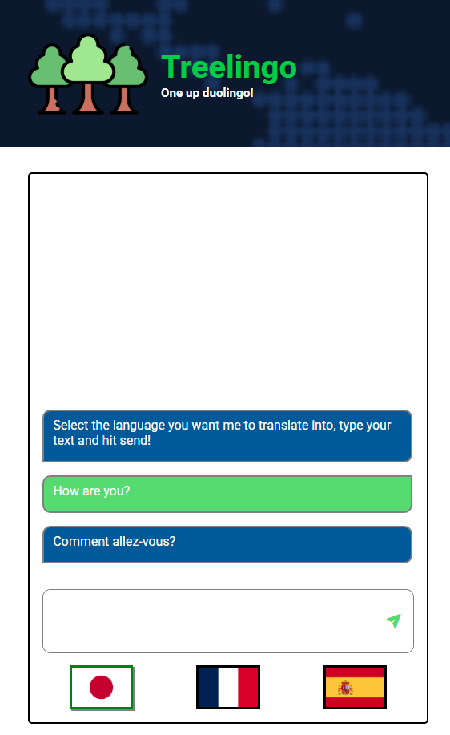
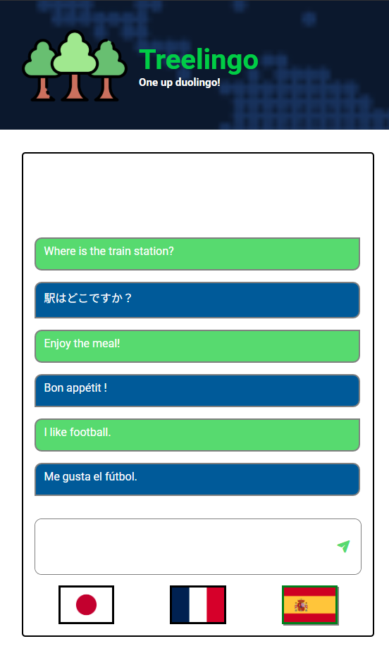

# Multilingual translator 
A chatbot that is powered by OpenAI's API to translate user's input messsages into japanese, french and spanish.

<div align='center'>
    
    
</div>

## Get started
Visit the application [here](https://openai-translator-1vy.pages.dev/)

## Key takeaways
1. Learn how to access and use OpenAI's API
    * Creating conversations
    * Creating text responses

2. Prompt Engineering
    * Instruct the chatbot to perform the translation tasks using the following prompt
        ```
            You are a language expert. You will be receiving 2 pieces of information, namely language and userQuery.
            Please translate the text in userQuery into the language input given by the user. If the user refers to 
            any of the message in this previous conversation, translate the referred message instead.

            Example:
            ### User-input
            language: japanese userQuery: Hello, nice to meet you!

            ### Your reply
            こんにちは、初めまして
        ```

3. Hide API key by interacting with OpenAI's API using cloudflare's worker instead of storing the API key on frontend.